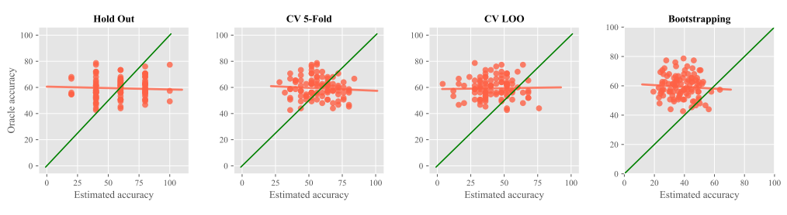

# Evaluating the Evaluators: Are Current Few-Shot Learning Benchmarks Fit for Purpose?

This is the official repository for the paper "Evaluating the Evaluators: Are Current Few-Shot Learning Benchmarks Fit for Purpose?" by [Luisa B. Shimabucoro](https://scholar.google.com/citations?hl=pt-BR&user=IYVqNJAAAAAJ&view_op=list_works), [Timothy M. Hospedales](https://scholar.google.com/citations?user=nHhtvqkAAAAJ&hl) and [Henry Gouk](https://scholar.google.com/citations?user=i1bzlyAAAAAJ&hl).

The paper was accepted at the *DMLR (Data-centric Machine Learning Research) Workshop at ICML'23*.

[[paper](https://arxiv.org/abs/2307.02732)][[bibtex](#citing-the-paper)]

<div align=center></div>

Here you can find all the code necessary to replicate the experiments presented in the paper, which are implemented in PyTorch. For details, see the paper: **[Evaluating the Evaluators: Are Current Few-Shot Learning Benchmarks Fit for Purpose?](https://arxiv.org/abs/2307.02732)**.

The implementations of the algorithms used are from [LibFewShot](https://github.com/RL-VIG/LibFewShot) and we thank the authors for the code provided.

## Setup

:warning: We would first like to note that the training and testing were made using a Linux environment and Python 3.6, so any divergences from these two noted points might require some additional changes by the user. To setup the environment following all the required dependencies for training and evaluation, please one of the two methods below:

**pip** - Clone the repository, create a virtual environment and then use the `requirements.txt` file to download all dependencies:
```
python3.6 -m venv evalFSLevaluators
source evalFSLevaluators/bin/activate
pip install -r requirements.txt
```

**conda** - Clone the repository, create a conda environment and install the dependencies present in the `requirements.txt`:
```
conda create -n python=3.6 evalFSLevaluators
conda install --force-reinstall -y --name evalFSLevaluators -c conda-forge --file requirements.txt
conda activate evalFSLevaluators
```
## Datasets
We provide the formated datasets available for download and ready to use in this [drive](https://drive.google.com/drive/folders/1XtTI3eQwgmyNY29bJl_nuMgDqBJHPmhC?usp=sharing). 

## Training
To train (or resume training) the models change directory to `LibFewShot` and run the following command (adapting the arguments to your needs):

```
python3 run_trainer.py \
      --config_path <PATH_TO_YAML_CONFIG_FILE> \
      --data_root <PATH_TO_DATASET> \
      --result_root <PATH_TO_STORE_RESULTS> \
      --n_gpu <NUM_OF_GPUS_TO_USE> \
      --device_ids <GPU_ID> \
      --allow_test \ # (optional) this flag should be added if you'd like to evaluate your model on the test set right after training
      --resume # (optional) this flag should be added if you'd like to resume training
```

For the config paths you can use the `.yaml` files present in the [reproduce](https://github.com/luisashimabucoro/EvalEvaluatorsFSL/tree/main/LibFewShot/reproduce) directory or you can create your own based on the ones provided. Another alternative is to use a config file and override some of the parameters defined in it by setting a new value using the command line parameters (you can check [here](https://github.com/luisashimabucoro/EvalEvaluatorsFSL/blob/516686fac32a2a6a4e7f95c08f8f0b7400dd5f67/LibFewShot/core/config/config.py#L115) the exact syntax of the commands/flags).


## Evaluation
To train (or resume training) the models change directory to `LibFewShot` and run the following command (adapting the arguments to your needs):

```
python3 run_test.py \
      --config_path <PATH_TO_YAML_CONFIG_FILE> \
      --data_root <PATH_TO_DATASET> \
      --result_root <PATH_TO_STORE_RESULTS> \
      --n_gpu <NUM_OF_GPUS_TO_USE> \
      --device_ids <GPU_ID> \
      --eval_types \ # (optional if already defined in the config file) defines types of evaluations to be performed (oracle,hold_out,cross_validation,bootstrapping)
      --experiment_dir # (optional) define specific name for folder where results should be stored
```
Similarly to the training setup the config file provided can be overrided using the command line parameters defined [here](https://github.com/luisashimabucoro/EvalEvaluatorsFSL/blob/516686fac32a2a6a4e7f95c08f8f0b7400dd5f67/LibFewShot/core/config/config.py#L115).

## Folder Organization
The directories are organized in the following way inside the LibFewShot folder:
* **config** - directory containing default LibFewShot settings for the backbone and classifiers
* **core** - directory containing the code used to perform the experiments
  * **data** - subdirectory with dataloaders and data processing pipelines
  * **model** - subdirectory with the implementations of the algorithms used organized by algorithm type (finetuning, metric and meta-learning based)
  * **utils** - subdirectory with utility modules and most importantly the implementations of the different evaluation methods used for each algorithm (oracle, hold-out, cross-validation and bootstrapping) 
  * *train* and *test* - files with the training and testing pipeline
* **reproduce** - contains `.yaml` files with all hyperparameter and general settings used for training/testing each combination of dataset (miniImageNet and CIFAR-FS (within-domain datasets) and Meta Album (multi-domain)) and algorithm (Baseline(++), ProtoNet, MAML and R2D2) used in the experiments
```
.
├── config
├── core
│   ├── data
│   │   ├── dataloader.py
│   │   ├── dataset.py
│   │   ├── meta_album_dataloader.py
│   │   └── samplers.py
│   ├── model
│   │   ├── abstract_model.py
│   │   ├── backbone
│   │   ├── finetuning
│   │   │   ├── baseline.py
│   │   │   ├── baseline_plus.py
│   │   │   ├── baseline_plus_cv.py
│   │   │   └── finetuning_model.py
│   │   ├── meta
│   │   │   ├── maml.py
│   │   │   ├── maml_cv.py
│   │   │   ├── meta_model.py
│   │   │   └─── r2d2.py
│   │   └── metric
│   │       ├── metric_model.py
│   │       ├── proto_net.py
│   │       └── proto_net_cv.py
│   ├── test.py
│   ├── trainer.py
│   └── utils
│       ├── evaluator.py
│       └── utils.py
├── reproduce
│   ├── Baseline
│   │   ├── MultiDomain
│   │   │   ├── baseline-md-split1.yaml
│   │   │   ├── baseline-md-split2.yaml
│   │   │   └── baseline-md.yaml
│   │   └── Within-domain
│   │       ├── baseline-cfs.yaml
│   │       └── baseline-og.yaml
│   ├── Baseline++
│   ├── Baseline++CV
│   ├── MAML
│   ├── MAMLCV
│   ├── Proto
│   ├── ProtoCV
│   └── R2D2
├── run_test.py
└── run_trainer.py
```
## Citing the paper

If you found the paper/repository useful please consider giving a star :star: and citation :t-rex::

```bibtex
@misc{shimabucoro2023evaluating,
      title={Evaluating the Evaluators: Are Current Few-Shot Learning Benchmarks Fit for Purpose?}, 
      author={Luísa Shimabucoro and Timothy Hospedales and Henry Gouk},
      year={2023},
      eprint={2307.02732},
      archivePrefix={arXiv},
      primaryClass={cs.LG}
}
```


